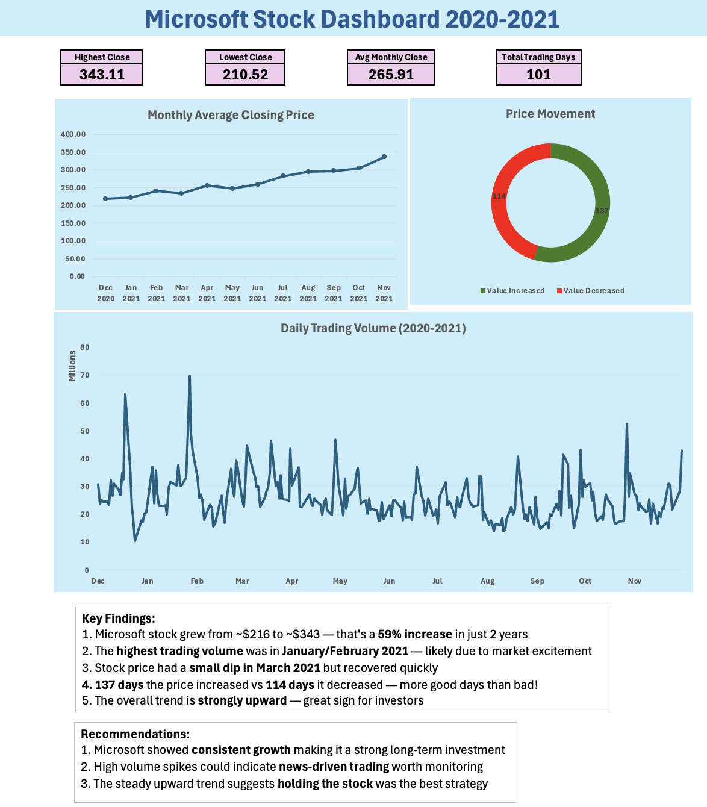

# Microsoft Stock Analysis 📈 (2020–2021)

An Excel-based analysis of Microsoft (MSFT) daily stock data —
exploring price trends, trading volume patterns, and monthly
performance across 2020 and 2021.

---

## Dashboard Preview

---

## Key Findings

- 📈 Stock grew from ~$216 to ~$343 — a **59% increase** in 2 years
- 📊 Highest trading volume in **Jan/Feb 2021** — likely news-driven
- 📉 Small dip in **March 2021** but recovered quickly
- ✅ **137 days** price increased vs 114 days decreased
- 🔼 Overall trend: **strongly upward**

## Recommendations

- Microsoft showed consistent growth — strong long-term investment
- Volume spikes suggest news-driven trading worth monitoring
- Steady upward trend suggests holding the stock was the best strategy

---

## What's inside

| File | Description |
|------|-------------|
| `EXCEL project.xlsx` | Raw data + analysis + dashboard |
| `dashboard.png` | Dashboard screenshot |

## Tools used

---

## About

Built as part of my MSc Business Analytics portfolio at Aston
University, Birmingham.

